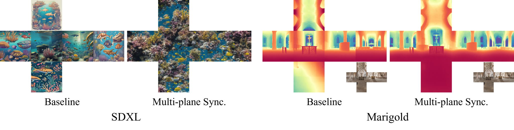
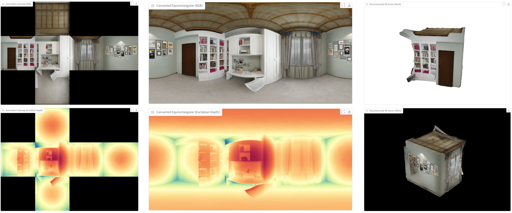

<h1 align="center">DreamCube: 3D Panorama Generation via Multi-plane Synchronization</h1>


<div align="center">
  
[](https://yukun-huang.github.io/DreamCube/)
[](https://arxiv.org/abs/2506.17206)
[](https://huggingface.co/KevinHuang/DreamCube)
[](https://www.youtube.com/watch?v=7x4Elc2tO6g)

</div>

<p align="left">

<br>
We propose <b>Multi-plane Synchronization</b> to adapt 2D diffusion models for multi-plane panoramic representations (i.e., cubemaps), which facilitates different tasks including RGB-D panorama generation, panorama depth estimation, and 3D scene generation.

Based on this design, we further introduce <b>DreamCube</b>, a diffusion-based framework for RGB-D cubemap generation from single-view inputs.
</p>

## 📢 News
- [2025-07-10] Add a Jupyter notebook for quickly trying Multi-plane Synchronization.
- [2025-06-26] Accepted to ICCV 2025!
- [2025-06-21] Release [project page](https://yukun-huang.github.io/DreamCube/), [model weights](https://huggingface.co/KevinHuang/DreamCube), and [inference code](https://github.com/Yukun-Huang/DreamCube).

## ⚙️ Setup
Please refer to `requirements.txt`.

## 💃🏻 Multi-plane Synchronization
If you are only interested in Multi-plane Synchronization, we provide a Jupyter notebook for quickly trying Multi-plane Synchronization on pre-trained diffusion models like SD2, SDXL, and Marigold. Please refer to `multi_plane_sync.ipynb` for more details.

The implementation is very simple. The key lines are as follows:
```python
pipe = StableDiffusionPipeline.from_pretrained(...)
apply_custom_processors_for_unet(pipe.unet, enable_sync_self_attn=True, enable_sync_cross_attn=False, enable_sync_conv2d=True, enable_sync_gn=True)
apply_custom_processors_for_vae(pipe.vae, enable_sync_attn=True, enable_sync_gn=True, enable_sync_conv2d=True)
```
<p align="middle">

</p>

## 🕺 DreamCube - Inference
We provide inference scripts for generating RGB-D cubemaps and 3D scenes (both mesh and 3dgs) from single-view inputs. The trained model weights are automatically downloaded from [HuggingFace](https://huggingface.co/KevinHuang/DreamCube).

### - Using the Gradio Interface
```bash
bash app.py --use-gradio
```
It takes about 20 seconds to produce RGB-D cubemap, RGB-D equirectangular panorama, and corresponding 3D scenes (both mesh and 3dgs) on a Nvidia L40S GPU.
<p align="middle">

</p>

### - Using the Command Line
```bash
bash app.py
```
The results will be saved to `./outputs`.

## 👏 Acknowledgement
This repository is based on many amazing research works and open-source projects: [CubeDiff](https://cubediff.github.io/), [CubeGAN](https://diglib.eg.org/items/33594150-5a5d-4d36-9957-aa8c88d4c835), [PanFusion](https://github.com/chengzhag/PanFusion), [MVDiffusion](https://github.com/Tangshitao/MVDiffusion), [PanoDiffusion](https://github.com/PanoDiffusion/PanoDiffusion), [WorldGen](https://github.com/ZiYang-xie/WorldGen), etc. Thanks all the authors for their selfless contributions to the community!

## 😉 Citation
If you find this repository helpful for your work, please consider citing it as follows:
```bib
@article{huang2025dreamcube,
  title={{DreamCube: RGB-D Panorama Generation via Multi-plane Synchronization}},
  author={Huang, Yukun and Zhou, Yanning and Wang, Jianan and Huang, Kaiyi and Liu, Xihui},
  year={2025},
  eprint={arXiv preprint arXiv:2506.17206},
  archivePrefix={arXiv},
  primaryClass={cs.CV},
}
```
